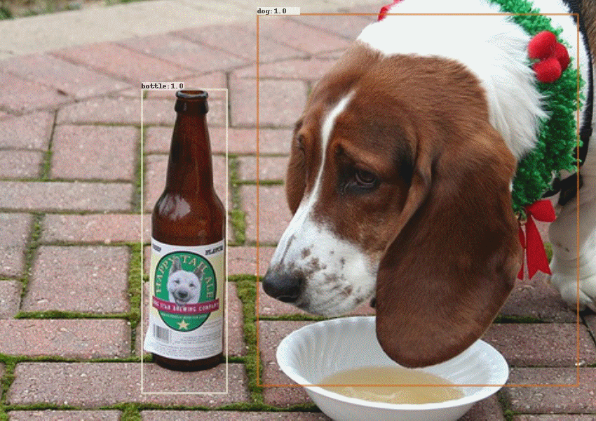

# Faster-RCNN_Tensorflow

## Abstract
This is a tensorflow re-implementation of [Faster R-CNN: Towards Real-Time ObjectDetection with Region Proposal Networks](https://arxiv.org/abs/1506.01497).     

This project is completed by [YangXue](https://github.com/yangxue0827) and [YangJirui](https://github.com/yangJirui). Some relevant projects ([R<sup>2</sup>CNN](https://github.com/DetectionTeamUCAS/R2CNN_Faster-RCNN_Tensorflow)) based on this code.

## Train on VOC 2007 trainval and test on VOC 2007 test (PS. This project also support coco training.)     


## Comparison
| Models | mAP | sheep | horse | bicycle | bottle | cow | sofa | bus | dog | cat | person | train | diningtable | aeroplane | car | pottedplant | tvmonitor | chair | bird | car | boat |
|------------|:---:|:--:|:--:|:--:|:---:|:--:|:--:|:--:|:--:|:--:|:--:|:---:|:--:|:--:|:--:|:--:|:---:|:--:|:--:|:--:|:--:|
|resnet50_v1|75.16|74.08|89.27|80.27|55.74|83.38|69.35|85.13|88.80|91.42|81.17|81.71|62.74|78.65|86.86|47.00|76.71|50.29|79.05|60.51|80.96|
|resnet101_v1|77.03|79.68|89.33|83.89|59.41|85.68|76.59|84.23|88.50|88.50|81.54|79.16|72.66|80.26|88.42|47.50|79.81|52.85|80.70|59.94|81.87|    
|mobilenet_v2|50.36|46.68|70.45|67.43|25.69|53.60|46.26|58.95|37.62|43.97|67.67|61.35|52.14|56.54|75.02|24.47|49.89|27.76|38.04|38.20|65.46|   

## Requirements
1、tensorflow >= 1.2     
2、cuda8.0     
3、python2.7 (anaconda2 recommend)    
4、[opencv(cv2)](https://pypi.org/project/opencv-python/)    

## Download Model
1、please download [resnet50_v1](http://download.tensorflow.org/models/resnet_v1_50_2016_08_28.tar.gz)、[resnet101_v1](http://download.tensorflow.org/models/resnet_v1_101_2016_08_28.tar.gz) pre-trained models on Imagenet, put it to $PATH_ROOT/data/pretrained_weights.     
2、please download [mobilenet_v2](https://storage.googleapis.com/mobilenet_v2/checkpoints/mobilenet_v2_1.0_224.tgz) pre-trained model on Imagenet, put it to $PATH_ROOT/data/pretrained_weights/mobilenet.     
3、please download [trained model](https://github.com/DetectionTeamUCAS/Models/tree/master/Faster-RCNN_Tensorflow) by this project, put it to $PATH_ROOT/output/trained_weights.   

## Data Format
```
├── VOCdevkit
│   ├── VOCdevkit_train
│       ├── Annotation
│       ├── JPEGImages
│   ├── VOCdevkit_test
│       ├── Annotation
│       ├── JPEGImages
```

## Demo(available)

**Select a configuration file in the folder ($PATH_ROOT/libs/configs/) and copy its contents into cfgs.py, then download the corresponding [weights](https://github.com/DetectionTeamUCAS/Models/tree/master/Faster-RCNN_Tensorflow).**      

```   
cd $PATH_ROOT/tools
python inference.py --data_dir='/PATH/TO/IMAGES/' 
                    --save_dir='/PATH/TO/SAVE/RESULTS/' 
                    --GPU='0'
```

## Eval
```  
cd $PATH_ROOT/tools
python eval.py --eval_imgs='/PATH/TO/IMAGES/'  
               --annotation_dir='/PATH/TO/TEST/ANNOTATION/'
               --GPU='0'
```

## Train

1、make tfrecord
```  
cd $PATH_ROOT/data/io/  
python convert_data_to_tfrecord.py --VOC_dir='/PATH/TO/VOCdevkit/VOCdevkit_train/' 
                                   --xml_dir='Annotation'
                                   --image_dir='JPEGImages'
                                   --save_name='train' 
                                   --img_format='.jpg' 
                                   --dataset='pascal'
```

2、compile
```  
cd $PATH_ROOT/libs/box_utils/cython_utils
python setup.py build_ext --inplace
```

3、train
```  
cd $PATH_ROOT/tools
python train.py
```

## Tensorboard
```  
cd $PATH_ROOT/output/summary
tensorboard --logdir=.
``` 


## Reference
1、https://github.com/endernewton/tf-faster-rcnn   
2、https://github.com/zengarden/light_head_rcnn   
3、https://github.com/tensorflow/models/tree/master/research/object_detection
